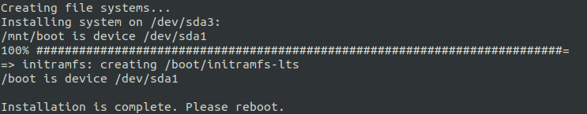
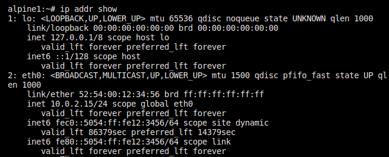
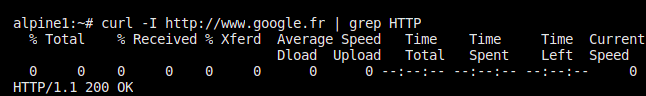
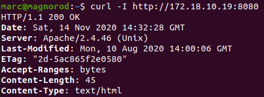
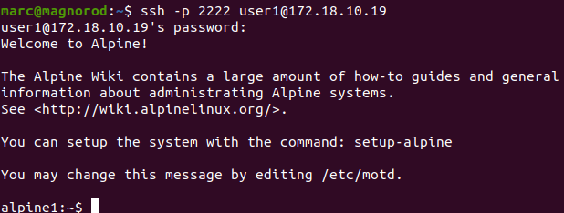

# RT0702 QEMU

## Installation des packages nécessaires à l’exécution d’une machine virtuelle Qemu

* sudo apt install qemu -y

## Installation d’une machine virtuelle Alpine dans Qemu. Vous réaliserez une installation système.

Vous utiliserez un disque virtuel de 2Go.

Création d'un fichier de 2Go qui deviendra un disque virtuel :

* qemu-img create -f qcow2 alpine.img 2G

Téléchargement du fichier iso de la distribution Alpine:

* wget http://dl-cdn.alpinelinux.org/alpine/v3.12/releases/x86_64/alpine-standard-3.12.1-x86_64.iso

## Démarrez la machine virtuelle selon la configuration suivante :

* 256 Mo de RAM
* clavier en français
* mode réseau user

le mode graphique SDL (Simple Direct Media Layer) est activé par défaut

Lancement de l'image Alpine:

* mémoire de 256 MO
* utilisation de curses pour la sortie video
* la langue du clavier sera le même que celle de l'hôte (pour l'autoboot)
* le système bootera sur d qui correspond par défaut au first CD-ROM
* le disque alpine.img sera utilisé pour stocker la VM alpine
* utilisation du mode user
* création d'une interface

qemu-system-x86_64 \ 
 -m 256 \
 -display curses \
 -boot d \ 
 -cdrom alpine-standard-3.12.1-x86_64.iso \ 
 -drive file=./alpine.img,format=qcow2 \ 
 -net user \ 
 -net nic

qemu-system-x86_64 -m 256 -display curses -boot d -cdrom alpine-standard-3.12.1-x86_64.iso -drive file=alpine.img,format=qcow2 -net user -net nic

Installation:
https://wiki.alpinelinux.org/wiki/Alpine_setup_scripts
3 modes d'install possible , diskless, data, sys

Récupérer un fichier answerfile pour le modifier par la suite:
* setup-alpine -c answerfile

options à modifier dans le fichier answerfile récupéré
 KEYMAPOPTS="fr fr"
 HOSTNAMEOPTS="-n alpine-perso"
 DISKOPTS="-m sys /dev/sda"
 #PROXYOPTS="http://webproxy:8080"

Lancement de l'installation avec l'answerfile perso:
* setup-alpine -e -f answerfile

### Démarrage de la VM
qemu-system-x86_64 -m 256 -k fr -net nic -net user -hda alpine.img -display curses

### tester de connexion réseau

ping de l'invité vers le serveur dhcp OK
* ping 10.0.2.2

ping de l'hote vers l'invité KO

* ping 10.0.2.15

installation du paquet curl et requete http sur le site www.google.fr

* apk add curl

* curl -I http://www.google.fr | grep HTTP 

on obtient OK donc accès vers l'extérieur possible 

## Question 4

Installez  dans  la machine  virtuelle  un  serveur  SSH  et  un  serveur  Apache.  Proposez  une  commande  de lancement de la machine virtuelle permettant de relayer:
* Un port de l'hôte vers le port 22 de l'invité
* Un port de l'hôtevers le port 80 de l'invité. 

### installation d'un serveur ssh et d'apache

* apk add openssh-server && apk add apache2
* apk update

rc-service apache2 restart
### création d'un utilisateur sur la VM alpine

Comme par défaut il n'est pas possible de se connecter en root en ssh, je crée un nouvel utilisateur:

* adduser -h /home/user1 -s /bin/sh -G user1

/home/*/public_html

qemu-system-x86_64 -k fr -m 256 -net nic -net user,hostfwd=tcp::8080-:80,hostfwd=tcp::2222-:22 -hda alpine.img -display curses 

* curl -I http://172.18.10.19:8080 | grep HTTP | awk {print $2}

* ssh -P 2222 user1@172.18.10.19

## Question 5

Réalisez deux clones liés(rebase) de votre machine virtuelle.Testez les machines que vous pouvez lancer simultanément.

