# TP5 Vagrant

## Q1)Installation de Vagrant

### Téléchargement et installation
* sudo apt-get install vagrant -y

### Q2) 

Rechercher une distrib prise en charge par Vagrant
* https://app.vagrantup.com/boxes/search

### Création du VagrantFile

* mkdir vm-ubuntu-18_04
* cv vm-ubuntu-18_04
* vagrant init "ubuntu/bionic64"

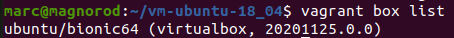

### Création et configuration de la VM
* vagrant up

### Connexion SSH
* vagrant ssh

### Récolte d'info

adresse ip
* ip addr show

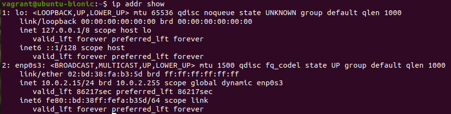

disque dur (sytème de fichiers)
* df -h

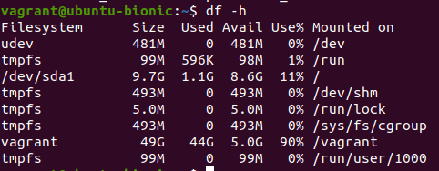

mémoire vive
* free -h

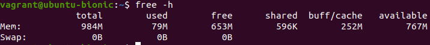

cpu
* lscpu 

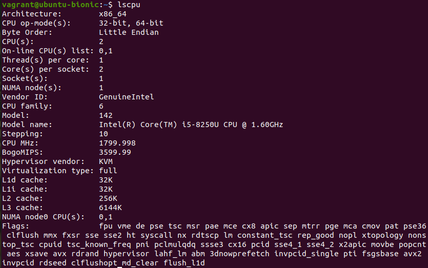

fichier partagé
* ls /vagrant

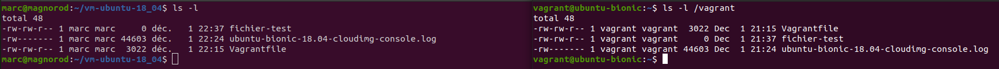

## Q3)

Pour utiliser le mode GUI virtualbox doit être installé !

modifier le Vagrantfile
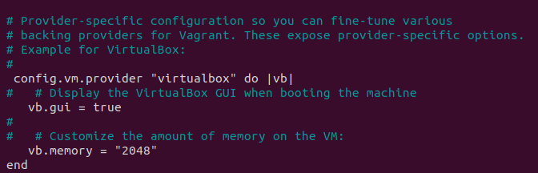

* vagrant up
* vagrant provision

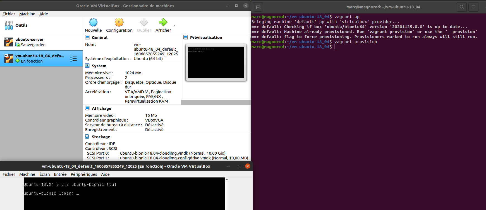

## Q4)

3 modes réseau

### mode forward de port:

forward du port 8080 de l'hôte sur le port 80 de l'invité

modif du Vagrantfile

* config.vm.network "forwarded_port", guest: 80, host: 8080

puis

* vagrant up

le forward de port s'effectue bien

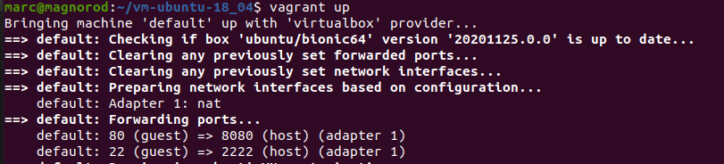

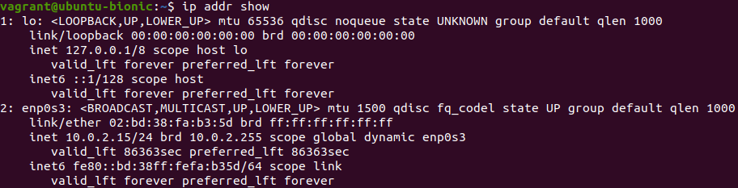

|ping source | ping destination | resultat |
|---|---|---|
|hote|invité| ko|
|invite|hote|ok

### mode prive : 

modif du Vagrantfile
* config.vm.network "private_network", ip: "192.168.33.10"
puis
* vagrant up

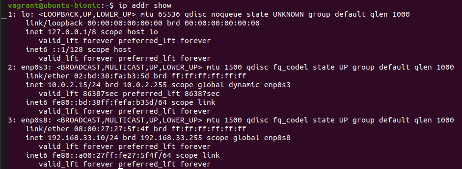

coté hôte on remarque qu'une interface est créée

|ping source | ping destination | resultat |
|---|---|---|
|hote|invité| ok|
|invite|hote|ok|

### mode public :

modif du Vagrantfile

* config.vm.network "public_network"

puis

* vagrant up

Utilisation d'un bridge sur l'interface de la carte wi-fi wlp2s0

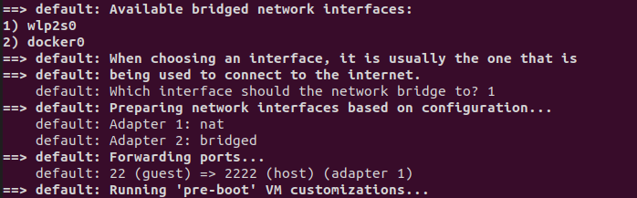

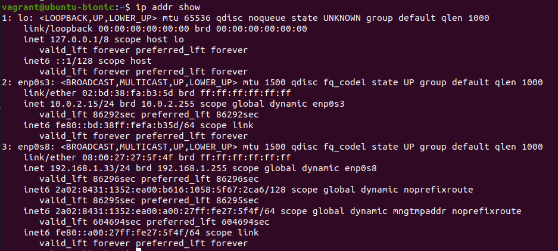

|ping source | ping destination | resultat |
|---|---|---|
|hote|invité| ok|
|invite|hote|ok

## Q5)

utilisation du mode réseau forward de port dans le Vagrantfile
* config.vm.network "forwarded_port", guest: 80, host: 8080

sur l'invité:
* sudo apt install apache2 -y

test sur l'invité:

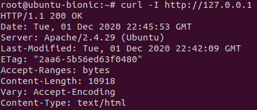

test sur l'hôte:

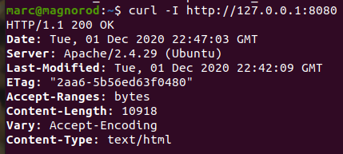

